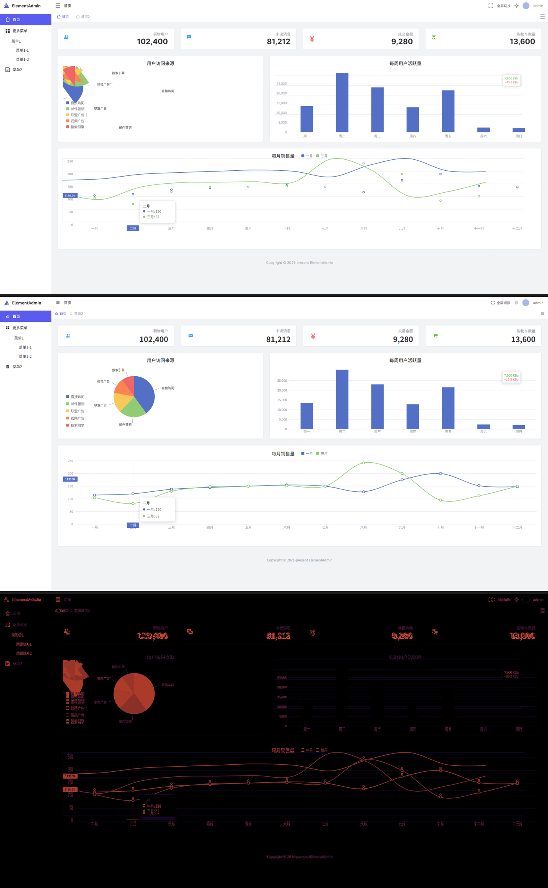
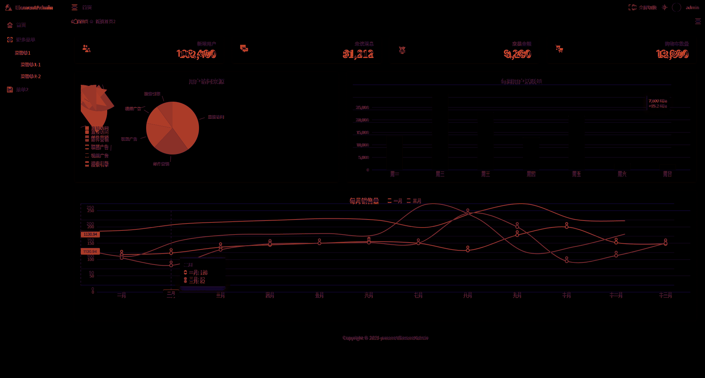

<!--
 * [变更日志]
 * 修改时间：2026-09-16
 * AI模型：Gemini 系列
 * 修改内容：1. 重新包装项目背景，添加作者的开发初衷与自学 AI 编程的历程介绍。
-->
# figma-agent-bridge

**中文** | [English](README.en.md)

## 📖 写在前面 / Background Story

你好，我是这个项目的作者。老实说，做这个项目没有什么宏大的愿景，最初纯粹是因为我自己在学 AI 编程时“被逼急了”。

当时我在折腾怎么让 AI 帮我画 UI，结果发现市面上的 Agent 大多只能“光说不练”——能看懂设计图，却没法真正在 Figma 里把东西一笔一划做出来。想要直接操作画布？要么受到各种技术限制，要么就是面临官方高昂的 API 付费墙。

既然现成的路走不通，我想，干脆自己造个轮子吧。于是我开始自己摸索，手搓了这条本地的 Bridge 通道。

其实我就是个普通的前端开发，在这之前并没有太多这种跨端通信的高深经验。但借着这个契机，我硬是靠着 AI 编程的辅助，一行行把这套链路跑通了，甚至一口气做了 9 个阶段的实验，把从“需求拆解”到“Figma 自动画图”，再到“Vue 代码生成和自动化测试”的全流程都亲自趟了一遍。

这个小小的项目对我个人意义很大。它是我自学 AI 编程的一次“死磕”，也是我想证明自己的一场实验——证明在这个 AI 时代，即使是一个人单打独斗，只要善用 AI 的力量，也能去挑战和完成原本以为很难搞定的硬核工作。

顺便提一句，**这个项目最珍贵的资产，其实并不是这些写好的代码本身，而是那些被原封不动保留在归档目录（如 `stages/` 和 `.workbuddy/`）中的执行记录与 Agent 记忆日志。** 它们原汁原味地记录了我在遇到技术死胡同时的排错思路、踩坑细节，以及如何一步步和 AI 协作打通全链路的真实过程。如果你想了解 AI 编程的真实面貌，这些记录绝对是不容错过的宝藏。

如果你也和我一样，在探索前端和 AI 结合的路上遇到了类似的痛点，希望这个项目能帮你省点力气。代码都在这里了，欢迎随便看，也随时欢迎来找我交流。

---

## 🚀 项目简介 / Introduction

让 AI Agent 通过一条自建本地通道，直接读写真实 Figma 画布——从设计系统构建、整页高保真设计，到 Vue 代码还原与像素级视觉回归的**全链路开源实验**。

不使用 Figma 官方付费 Write to Canvas，不依赖任何 MCP 的写入能力，自建本地写入通道（HTTP Bridge + Figma 开发插件），并用它在真实 Figma 画布上完成了 7 个真实 UI（1 个设计系统 + 6 个完整页面），把其中一个转成 Vue3 + Tailwind 网页，做了程序化像素级视觉回归与真实浏览器交互回归。

> Roadmap：项目正在向 **MCP Server** 与 **Agent Skills** 形态演进，见 [Roadmap](#-roadmap--路线图)。

---

## 架构 / Architecture

```
WorkBuddy Agent / figma-vibe CLI
        │  HTTP POST /v1/command   (?token=…)
        ▼
   Bridge  (127.0.0.1:45677, 仅回环, token 认证, 同步语义)
        │  HTTP GET /v1/poll  ← long-poll，插件主动来取
        ▼
   Figma Plugin UI (iframe)      ←—— 唯一有网络能力的一层
        │  postMessage
        ▼
   Figma Plugin 主线程  →  Figma Plugin API  →  真实画布节点
```

详细协议、34 个原子操作与排错表见 [`docs/bridge-architecture.md`](docs/bridge-architecture.md)。

## 九个阶段 / Nine Stages

| 阶段 | 内容 | 关键产物 | 结果 |
|---|---|---|---|
| [Stage 1-2](stages/stage1-2-bridge-channel/) | 写入通道 + 34 个原子操作 | bridge / plugin / cli | selftest 91/91，真实画布断言 35/35 |
| [Stage 3](stages/stage3-saas-dashboard/) | 首个真实 Vibe Design：SaaS 教育仪表盘 | 274 节点 / 10 组件 / 0 IMAGE | audit 42/42 |
| [Stage 4](stages/stage4-pixelflow-ai/) | Agent 自主设计闭环：PixelFlow AI 暗色工具 | 188 节点 / 17 组件 | audit 42/42（自查补漏） |
| [Stage 5](stages/stage5-elementadmin-figma/) | 仅凭截图高还原 ElementAdmin（1920×1030） | 207 节点 / 25 程序化 VECTOR | audit 47/47，自评 89/100 |
| [Stage 6](stages/stage6-vue-elementadmin/) | Figma → Vue3 + Tailwind → 浏览器 | Vite5 + Vue3.4 + Tailwind3.4 | 两轮 QA 88→93/100 |
| [Stage 7](stages/stage7-visual-regression/) | 程序化像素级视觉回归 | 自研 diff 工具 + 32 节报告 | Pixel Diff **5.691%** / SSIM **0.9037** / Final **92/100** |
| [Stage 8](stages/stage8-interaction-regression/) | 真实浏览器事件交互回归（40 项） | Playwright 交互矩阵 + 证据截图 | PASS 24 / FAIL 0 / READY FOR STAGE 9 |
| [Stage 9](stages/stage9-product-expansion/) | 产品化扩展：IA 规划 + 设计系统 + 多页面 | 25 个 native DS 组件 + User List / Exam List / Exam Detail / Settings | 各项审计全绿，新增正式组件 0 |

## 目录结构 / Repository Layout

```
├── bridge/          本地 Bridge（Node 内置模块，零 npm 依赖）
├── plugin/          Figma 开发插件（manifest + code.js + ui.html）
├── cli/             figma-vibe CLI（声明式命令表）
├── tools/           selftest / verify / probe / build / audit 脚本
├── examples/        命令示例 JSON
├── stage6-element-admin/   Stage 6 Vue3 + Tailwind 项目（回归实验对象）
├── stages/          ★ 各阶段产物归档（每阶段 README、审计 JSON、几何 dump、截图、diff 数据）
│   ├── stage1-2-bridge-channel/
│   ├── stage3-saas-dashboard/
│   ├── stage4-pixelflow-ai/
│   ├── stage5-elementadmin-figma/
│   ├── stage6-vue-elementadmin/
│   ├── stage7-visual-regression/
│   ├── stage8-interaction-regression/
│   └── stage9-product-expansion/   （含 data/ 下 17 份审计 JSON）
├── docs/
│   ├── bridge-architecture.md     通道架构与协议
│   ├── stage7-visual-regression.md  32 节视觉回归报告（可独立审阅）
│   ├── stage8-interaction-regression.md  40 项交互回归矩阵
│   ├── stage9-*.md                IA / 设计系统 / 9.2-A / 9.2-B 报告
│   ├── communication-log.md       ★ 各阶段沟通记录
│   └── lessons-learned.md         ★ 经验教训（中英标题）
└── .vibe/           运行时状态（token 不入库；审计数据已归档至 stages/）
```

## 快速开始 / Quick Start

```bash
# 1. 启动 Bridge
node bridge/server.js

# 2. mock 自测（不需要 Figma）
node tools/selftest.js

# 3. Figma Desktop → Plugins → Development → Import manifest.json → 运行插件

# 4. 真实画布验证（需要插件在线）
node tools/stage2-verify.js

# 5. Stage 6 前端（回归实验对象）
cd stage6-element-admin && npm install && npm run dev   # http://127.0.0.1:5180
```

## 安全 / Security

- `.vibe/token`（Bridge 鉴权令牌）与所有日志已被 `.gitignore` 排除，不入库。
- Bridge 只绑回环地址 `127.0.0.1`；插件只允许访问 `localhost`。
- 文档与审计数据中的 "token" 均指设计令牌（颜色/字号 token），非鉴权凭据。

## 核心结论 / Headline Results

- **通道可靠性**：命令同步语义 + waiter 存活检查 + 客户端注册制，消灭静默丢命令与假阳性。
- **设计还原**：仅凭截图在 Figma 还原 ElementAdmin 自评 89/100；转 Vue 后与 Figma 渲染基准像素 Diff 5.691%（SSIM 0.9037，Final 92/100），布局骨架与全部 17 个颜色 token 0px 差异。
- **交互回归**：40 项真实浏览器事件 24 PASS / 0 FAIL。
- **产品化**：在全新 Figma 文件程序化构建 25 个 native DS 组件与 4 个业务页面，复用率 100%（新增正式组件 = 0）。
- 全部经验沉淀在 [`docs/lessons-learned.md`](docs/lessons-learned.md)，全部阶段沟通在 [`docs/communication-log.md`](docs/communication-log.md)。

## 🗺 Roadmap / 路线图

- [ ] **MCP Server**：把 Bridge 的 34 个原子操作封装为标准 MCP 工具（create-frame / set-auto-layout / run batch …），任何支持 MCP 的 Agent 均可直接操作 Figma 画布。
- [ ] **Agent Skills**：沉淀「截图还原」「设计系统构建」「像素级回归」三条可复用 Skill 工作流。
- [ ] **像素回归工具独立发包**：`pixel-diff.py` + 证据链生成器抽为独立 CLI 包。
- [ ] 欢迎提 Issue 讨论 API 设计与命名。

## 👀 效果展示 / Showcases

**1. 最终产出对比 (Figma vs Vue3 真实渲染)**
左侧为 Agent 在 Figma 中自动绘制的设计稿，右侧为生成的 Vue3+Tailwind 代码在真实浏览器中的渲染效果。肉眼几乎难以分辨差异。


**2. 像素级视觉回归热力图 (Pixel Diff Heatmap)**
通过自研的自动化视觉回归工具得出的对比热力图。深色区域代表像素差异，可以看到除了极个别抗锯齿和浏览器差异外，整体骨架与颜色（17 个 Token）达到了完美的像素级还原。


## License

MIT
